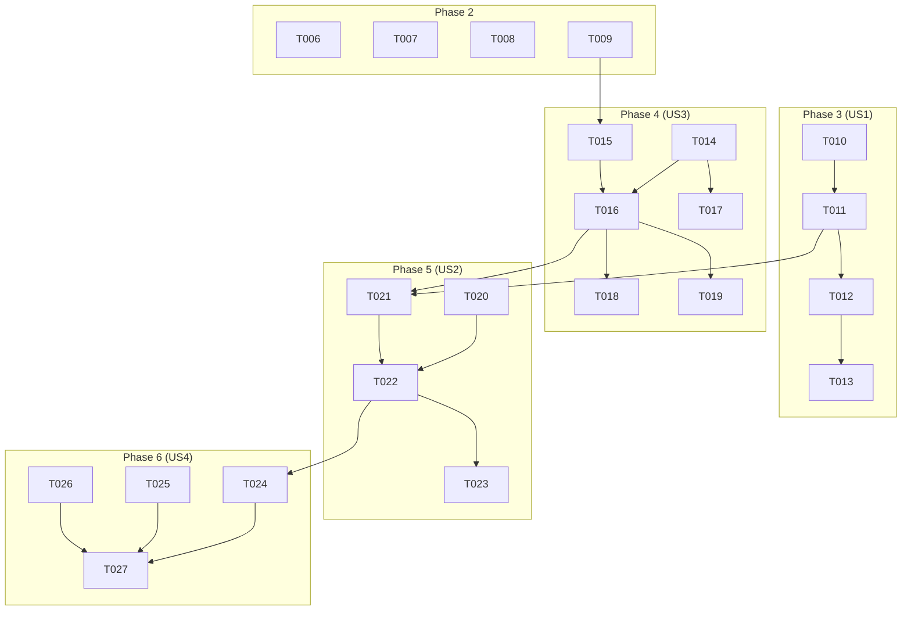

# Tasks: Agent MCP Integration and Knowledge Store

This document outlines the tasks required to implement the feature.

## Phase 1: Setup

- [X] T001 Create `docker-compose.yml` with service definitions for `app`, `sqlite`, and `nginx`.
- [X] T002 Create a placeholder `mcp_servers.json` file in the project root.
- [X] T003 Create a `Dockerfile` for the main application.
- [X] T004 Create an `nginx.conf` file for the nginx service.
- [X] T005 Update dependencies in `requirements.txt` to reflect actual implementation: `fastapi`, `uvicorn`, `httpx`, `aiosqlite`, `PyYAML`, `pydantic`. (No `sqlalchemy` or Ollama SDK required)

## Phase 2: Foundational

- [X] T006 [P] Implement the core FastAPI application setup in `src/main.py`.
- [X] T007 [P] Set up the SQLite database connection in `src/core/database.py`.
- [N/A] T008 SQLAlchemy model not required; KnowledgeEntry persistence implemented via aiosqlite direct SQL in `src/services/knowledge_service.py`.
- [X] T009 Create a script to initialize the database tables in `src/core/db_init.py`.

## Phase 3: User Story 1 - Configure Agents with MCP Servers

**Goal**: As a developer, I want to configure an agent to use one or more MCP servers so that the agent can leverage external information sources.
**Independent Test**: Create a configuration for an agent with MCP server details and verify that the agent can successfully connect to the server by checking the `/mcp/status` endpoint.

- [X] T010 [US1] Update agent configuration loading in `src/config/loader.py` to handle `mcp_servers`.
- [X] T011 [US1] Implement the MCP server manager in `src/services/mcp_manager.py` to load and manage MCP server configurations from `mcp_servers.json`.
- [X] T012 [US1] Implement the `/mcp/status` endpoint in `src/api/routes/mcp.py`.
- [X] T013 [US1] Add unit tests for the MCP manager in `tests/unit/test_mcp_manager.py`.

## Phase 4: User Story 3 - Knowledge Store for Novel Writing

**Goal**: As a writer, I want to store and search knowledge about novel writing, so that I can easily find information and ideas for my work.
**Independent Test**: Add a new knowledge entry via the API and then retrieve it using the search endpoint.

- [X] T014 [P] [US3] Implement the embedding service in `src/services/embedding_service.py` to connect to Ollama and generate embeddings.
- [X] T015 [US3] Implement the knowledge store service in `src/services/knowledge_service.py` with methods for creating and searching entries.
- [X] T016 [US3] Implement the `/knowledge` and `/knowledge/search` endpoints in `src/api/routes/knowledge.py`.
- [X] T017 [P] [US3] Add unit tests for the embedding service in `tests/unit/test_embedding_service.py`.
- [X] T018 [US3] Add unit tests for the knowledge store service in `tests/unit/test_knowledge_service.py`.
- [X] T019 [US3] Add integration tests for the knowledge API endpoints in `tests/integration/test_knowledge_api.py`.

## Phase 5: User Story 2 - General Agent for Answering Questions

**Goal**: As a user, I want to interact with a general agent that can answer my questions, so that I can get information on a variety of topics.
**Independent Test**: Send a question to the agent and verify that it returns a relevant answer by utilizing one of the configured MCP servers.

- [X] T020 [US2] Implement the general agent in `src/agents/general_agent.py`.
- [X] T021 [US2] Update the agent service in `src/services/agent_service.py` to include logic for selecting an MCP server based on tool descriptions.
- [X] T022 [US2] Implement or update the agent invocation endpoint in `src/api/routes/agents.py`.
- [X] T023 [US2] Add unit tests for the general agent in `tests/unit/test_general_agent.py`.

## Phase 6: User Story 4 - Dockerized Deployment with Nginx

**Goal**: As a developer, I want to use Docker Compose to set up the entire application stack.
**Independent Test**: Run `docker-compose up` and access the application's health check endpoint through the Nginx proxy.

- [X] T024 [US4] Finalize the `docker-compose.yml` file with all services and configurations.
- [X] T025 [US4] Finalize the `nginx.conf` file with the correct reverse proxy settings.
- [X] T026 [US4] Add a health check endpoint to `src/main.py`.
- [X] T027 [US4] Add integration tests for the Docker deployment in `tests/integration/test_docker_run.py`.

## Phase 7: Polish & Cross-Cutting Concerns

- [X] T028 [P] Add structured logging to all services.
- [ ] T029 [P] Implement comprehensive error handling and input validation for all API endpoints.
- [X] T030 Update the project's `README.md` with documentation for the new features.

## Dependencies

## Parallel Execution

-   **Phase 2**: T006 and T007 can be done in parallel.
-   **Phase 3 & 4**: User Story 1 (Phase 3) and User Story 3 (Phase 4) can be worked on in parallel after Phase 2 is complete.
-   **Within US3**: T014 and T017 can be done in parallel with T015.

## Implementation Strategy

The implementation will follow an MVP-first approach. The initial focus will be on completing User Story 1 and User Story 3 to establish the core functionality of MCP integration and the knowledge store. User Story 2 will be implemented next, followed by the final deployment and polish tasks. This incremental approach allows for early testing and validation of the key features.
